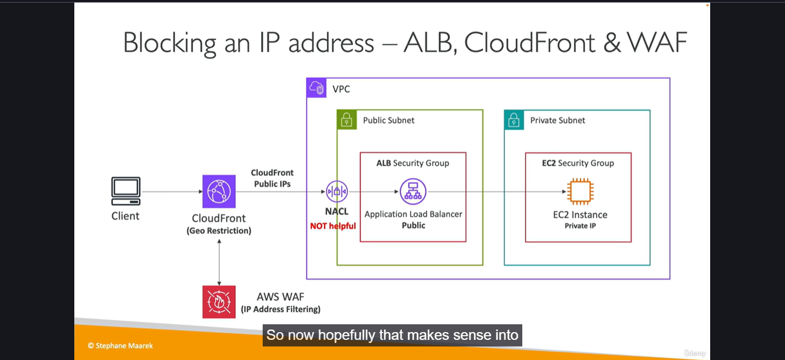

# DDoS and AWS Shield #security #shield
collapsed:: true
    - [Shield | Resources | hashicorp/aws | Terraform | Terraform Registry](https://registry.terraform.io/providers/hashicorp/aws/latest/docs/resources/shield_application_layer_automatic_response)
    - **Distributed Denial-of-Service (DDoS)**
        - When your service is unavailable because it's receiving too many requests
        - S*YN Flood* (Layer 4, send too many TCP connection requests), *UDP Reflection* (Layer 4, get other serves to send many big UDP requests), *DNS Flood attack* (overwhelm the DNS so legitimate users can't find the site), *Slow Loris attack* (a lot of HTTP connections are opened and maintained)
    - Application level attacks
        - More complex, more specific (Layer 7, HTTP level)
        - Cache bursting strategies: overload the backend database by invalidating cache
    - **DDoS Protection in AWS**
        - **AWS Shield Standard** -> protects against DDoS attack for your website and apps, for all customers at no additional costs
            - Provides protection from attacks such as SYN/UDP Floods, Reflection attacks and other layer 3/layer 4 attacks
        - **AWS Shield Advanced** -> 24/7 premium DDoS protection (DRP team)
            - Optional DDoS mitigation service (~$3000/month, 1 year subscription commitment + Data Transfer Out Usage Fees)
            - Protect against higher fees during usage spikes due to DDoS
        - **AWS WAF** -> application-level protection, filter specific requests based on rules
        - **CloudFront and Route 53** -> availavility protection using global edge networks, combined with Shield, provides DDoS attack mitigation at the edge
        - **AWS Auto Scaling** -> be ready to scale
        - Separate static resources (S3, CloudFront) from dynamic ones (EC2, ALB)
    - **Additional Resources**
        - [AWS Best Practices for DDoS Resiliency - AWS Best Practices for DDoS Resiliency](https://docs.aws.amazon.com/whitepapers/latest/aws-best-practices-ddos-resiliency/aws-best-practices-ddos-resiliency.html)
        - [Mitigation techniques - AWS Best Practices for DDoS Resiliency](https://docs.aws.amazon.com/whitepapers/latest/aws-best-practices-ddos-resiliency/mitigation-techniques.html)
        -
- # AWS Web Application Firewall (WAF) #security #waf
  collapsed:: true
    - [WAF | Resources | hashicorp/aws | Terraform | Terraform Registry](https://registry.terraform.io/providers/hashicorp/aws/latest/docs/resources/wafv2_api_key)
    - Protects your web apps from common web exploits (Layer 7)
        - Deploy on **ALB** (localised rules), **API Gateway** (rules running at the regional or edge level), **CloudFront** (rules globally on edge locations), **AppSync** (protect your GraphQL APIs)
        - Define **Web ACLs**
            - Rules can include IP addresses, HTTP headers/body or URI strings
            - Protects from common attacks, like SQL Injection and XSS
            - Size constraints, Geo match
            - Rate-based rules (to count occurrences of events)
            - Rules actions -> Count - Allow - Block - CAPTCHA - Challenge
    - **AWS Managed Rules**: library of over 190 managed by AWS an AWS Marketplace Sellers, ready-to-use rules
        - **Baseline Rule Groups** -> general protection for common threaths
        - **Use-case Specific Rule Groups** -> protection for many AWS WAF use cases
        - **IP Reputation Rule Groups** -> block requests based on source
        - **Bot Control Managed Rule Group** -> block and manage requests from bots
    - **WAF Logging**
        - CloudWatch Logs log group -> 5MB/s
        - S3 bucket -> 5' sending interval
        - Kinesis Data Firehose -> limited by Firehose quotas, but you can use any Kinesis Firehose destinations once data reach KDF
    - ## Solution Architecture - Enhance CloudFront Origin Security with AWS WAF & AWS Secrets manager #security #waf #sa
        - 1. Set a WAF between users and CloudFront with a Web ACL
        - 2. Use a Custom HTTP Header on CloudFront
            - X-Origin-Verify: xxxxxxxxx
        - 3. Set another WAF between CloudFront and ALB. This one will validate that the custom HTTP header meets the requirements
        - 4. Secret is stored on Secrets Manager, allowing auto-rotate. A Lambda Function will update the secrets on CloudFront and the filtering rule on the second WAF each time the secret is rotated
- # AWS Firewall Manager #security #fwmanager
  collapsed:: true
    - [Firewall Manager | Resources | hashicorp/aws | Terraform | Terraform Registry](https://registry.terraform.io/providers/hashicorp/aws/latest/docs/resources/fms_admin_account)
    - Manage rules in all accounts of an AWS Organization
    - Security policy: common set of security rules, created at the region level
        - WAF rules
        - AWS Shield Advanced
        - Security Groups for EC2, ALB and ENI resources in VPC
        - AWS Network Firewall (VPC level)
        - Amazon Route 53 Resolver DNS Firewall
    - Rules are applied to new resources as they are created (good for compliance) across all and future accounts in your Organization
    - **WAF vs. Firewall Manager vs. Shield**
        - Use tihis three services togheter for comprehensive protection
        - For granular protection of your resources -> WAF
        - To use AWS WAF across accounts, accelerate its configuration, automate the protection of new resources -> Firewall Manager with AWS WAF
        - DDoS attacks -> Shield
            - Shield Advanced use case are related to dedicated support, if you are prone to frequent DDoS attacks, advanced reporting,...
- # Blocking an IP Address #security #sa
  collapsed:: true
    - Simple scenario
        - NACL + EC2 SGs + FW SW running on EC2 (optional)
        - Using just a single public subnet
    - With ALB/NLB
        - 2 subnets: a public subnet, where the NACL + ALB/NLB reside, and a private subnet, where the EC2 is allocated.
    - ALB + WAF
        - WAF allows IP Address Filtering
    - ALB + CloudFront + WAF (**MOST SECURE**)
        - IP Address Filtering is located at CloudFront level. CloudFront also applies Geo Restriction to block an specific country
        - At ALB level, you only allow all CloudFront public IPs on its SGs
        - Now, NACL is not helpful at all
        - 
- # Amazon Inspector #security #inspector
  collapsed:: true
    - [Amazon Inspector | Resources | hashicorp/aws | Terraform | Terraform Registry](https://registry.terraform.io/providers/hashicorp/aws/latest/docs/resources/inspector2_delegated_admin_account)
    - Automated Security Assessments
        - Continuous scanning of the infrastructure, only when needed
            - CVE database -> package vulnerabilities (EC2, ECR & Lambda)
            - Network reach ability (EC2 only)
        - A risk score is associated with all vulnerabilities for prioritisation
    - For **EC2 instances**
        - Leverage in the AWS SSM agent
        - Analyse the running OS against known vulnerabilities and unintended network accessibility
    - For **container images pushed to Amazon ECR**
    - For **Lambda Functions**
        - Identifies SW vulnerabilities in function code and package dependencies
        - Assessment of function as they are deployed
    - Reporting & integration with AWS Security Hub -> centralize findings
    - Send findings to Amazon Event Bridge -> automations
- # AWS Config #security #config
  collapsed:: true
    - [AWS Config | Resources | hashicorp/aws | Terraform | Terraform Registry](https://registry.terraform.io/providers/hashicorp/aws/latest/docs/resources/config_aggregate_authorization)
    - Helps with auditing and recording **compliance** of your AWS resources
        - View compliance and configuration over time
        - View CloudTrail API calls if enabled to check who made these changes
    - Helps record configuration and changes over time
    - **Config Rules does not prevent actions from happening (no deny)**
        - Can use AWS-managed config rules (>75)
        - You can make custom config rules (must be defined in AWS Lambda)
        - Rules can be evaluated/triggered for each config change and/or at schedule
        - Trigger Amazon EventBridge if the rule is non-compliant (chain with Lambda)
        - Rules can have auto-remediation through SSM Automations
            - Non-compliant resource -> trigger an auto remediation
                - Ex: stop instances with non-approved tags
    - You can receive alerts (SNS) for any changes
    - **Regional service**
    - Can be aggregated across regions and accounts
- # AWS Managed Logs #security #managedlogs
  collapsed:: true
    - **Load Balances Access Logs (ALB, NLB, CLB)** -> to S3
        - Access logs for your Load Balancers
    - **CloudTrail Logs** -> to S3 and CloudWatch Logs
        - Logs for API call made within your account
    - **VPC Flow Logs** -> to S3, CloudWatch Logs, Kinesis Data Firehose
        - Info about IP traffic going to and from network interfaces in your VPC
    - **Route 53 Access Logs** -> to CloudWatch Logs
        - Log info about the queries that Route 53 receives
    - **S3 Access Logs** -> to S3
        - Server access logging provides detailed records for the requests that are made to a bucket
    - **CloudFront Access Logs** -> to S3
        - Detailed info about every user request that CloudFront receives
    - **AWS Config** -> to S3
- # Amazon GuardDuty #security #guardduty
  collapsed:: true
    - [GuardDuty | Resources | hashicorp/aws | Terraform | Terraform Registry](https://registry.terraform.io/providers/hashicorp/aws/latest/docs/resources/guardduty_detector)
    - Intelligent Threat discovery to protect your AWS Account
    - Uses ML algorithms, anomaly detection, 3rd party data
    - One-click to enable (30 days of free trial), no need to install SW
    - Input data includes
        - CloudTrail Event Logs -> unusual APi calls, unauthorized deployments
            - CloudTrail Management Events
            - CloudTrail S3 Data Events
        - VPC Flow Logs -> unusual internal traffic, unusual Ip address
        - DNS Logs -> compromised EC2 instances sending encoded data within DNS queries
        - K8S Audit Logs -> suspicious activities and potential EKS cluster compromises
        - Lambda Network activity, EBS Volumes, S3 Logs, RDS & Aurora Login Activity
    - Can setup EventBride rules to be notified in case of findings
    - EventBridge rules can target AWS
    - **Can protect against CryptoCurrency attacks** (dedicated finding for it)
    - **Delegated Administrator**
        - AWS Organizations member accounts can be designated to be a GuardDuty Delegated Administrator
        - Have full permissions to enable and manage GuardDuty for all accounts in the Organization
        - Can be done only using the OU Management Account
- # IAM Advanced Policies #security #iam
  collapsed:: true
    - **IAM Conditions**
        - *aws:SourceIp* -> restrict the client IP from which the API call are being made
        - *aws:RequestedRegion* -> restrict the region the API calls are made to
        - *ec2:ResourceTag* -> restrict EC2 actions based on tags
            - *aws:PrincipalTag/<tag_key_name>* -> applies to the user that make the API call
        - *aws:MultiFactorAuthPresent* -> to force MFA
    - **IAM for S3**
        - Differences between bucket level permission (just the bucket ARN) and object level permissions (**/***)
    - **Resource policies & _aws:PrincipalOrgID_**
        - *aws:PrincipalOrgID* can be used in any resource policies to restrict access to accounts that are member of an AWS Organization
- # EC2 Instance Connect #security #ec2
  collapsed:: true
    - [aws_ec2_instance_connect_endpoint | Resources | hashicorp/aws | Terraform | Terraform Registry](https://registry.terraform.io/providers/hashicorp/aws/latest/docs/resources/ec2_instance_connect_endpoint)
    - Uses **_SendSSHPublicKey API_**
        - Just allow SSH on EC2 Instance Connect IP range (see full list [here](https://ip-ranges.amazonaws.com/ip-ranges.json))
        - Use **one-time SSH public key**, valid for 60"
        - **All connections are logged in CloudTrail**
- # AWS Security Hub #security #securityhub
  collapsed:: true
    - [Security Hub | Resources | hashicorp/aws | Terraform | Terraform Registry](https://registry.terraform.io/providers/hashicorp/aws/latest/docs/resources/securityhub_account)
    - Central security tool to manage security across several AWS accounts and automate security checks
    - Integrated dashboards showing current security and compliance status to quickly take actions
    - Automatically aggregates alerts in predefined or personal findings formats from various AWS services & AWS partner tools
        - Config, GuardDuty, Inspector, Macie, IAM Access Analyzer, AWS Systems manager, AWS Firewall manager, AWS Health, AWS Partner Network Solutions
    - **MUST** first enable the AWS Config Service
    - Can cover multiple accounts at a time
    - Anytime there is a security issue, this is going to generate an EventBridge event
    - To investigate the source of these issues, you can use Amazon Detective to check where the security issues are coming from
    - [Pricing](https://aws.amazon.com/security-hub/cspm/pricing/) is based per check and per finding. 30-day free trial
- # Amazon Detective #security #detective
  collapsed:: true
    - [Amazon Detective | Resources | hashicorp/aws | Terraform | Terraform Registry](https://registry.terraform.io/providers/hashicorp/aws/latest/docs/resources/detective_graph)
    - GuardDuty, Macie, and Security Hub are used to identify potential security issues or findings
    - Sometimes security findings require deeper analysis to isolate the root cause and take actions (complex process)
    - Amazon Detective analyzes, investigates and quickly identifies the route cause of security issues or suspicious activities (using ML and graphs)
        - Automativally collects and processes events from VPC Flow Logs, CloudTrail, GuardDuty and create a unified view
        - Produces visualizations with details and context to get to the root cause
- # Solutions Architecture on AWS #compute #sa
  collapsed:: true
    - **ALL SOLUTIONS ARCHITECTURE DECISIONS MADE WILL IMPACT THE COST, DURABILITY, AVAILABILITY, SCALABILITY,...**
    - 3 layers
        - **DNS layer**
        - **Web Layer** -> **Compute Layer** -> **Database Layer | Caching/Session Layer | Storage Layer | Decoupling Orchestration Layer | Static Assets Layer**
        - **CDN Layer** -> **Web Layer** | **Static Assets Layer**
- # Elastic Cloud Compute (EC2) #compute #ec2
  collapsed:: true
    - [EC2 | Resources | hashicorp/aws | Terraform | Terraform Registry](https://registry.terraform.io/providers/hashicorp/aws/latest/docs/resources/ami)
    - **Instance Types**
        - **R** -> RAM-intesive workloads
        - **C** -> CPU-intensive workloads
        - **M** -> general usage
        - **I** -> good local I/O - databases
        - **G** -> apps that need a GPU
        - **T2/T3**: burstable instances. Unlimited burst. General purpose
        - To check all computing instance types, check [Instances, Presented by Vantage](https://instances.vantage.sh/)
    - **Placement Groups**
        - Control the EC2 Instance placement strategy using placement groups
        - Group Strategies
            - **Cluster**: group instances into a low-latency group in a single AZ
                - Same rack, same AZ
                    - **Pros**
                        - Great network (10 Gbps)
                            - Choose instance type that has Enhanced Networking to leverage on this feature
                    - **Cons**:
                        - If the rack fails, all instances fails at the same time
                - **Use cases**
                    - Big Data jobs that need to complete fast
                    - Apps that require extremely low latency and high network throughput
            - **Spread**: spreads instances across underlying HW. Critical apps
                - Different racks in many AZs (max. 7 instances per group per AZ)
                - **Pros**
                    - Can span across AZs
                    - Reduced risk is simultaneous failure
                    - EC2 instances are on different physical HW
                - **Cons**
                    - Limited to 7 instances per AZs per placement group
                - **Use cases**
                    - App that require to maximize high availability
                    - Critical Applications where each instance **MUST** be isolated from failure from each other
            - **Partition**: spreads instances across many different partitions within an AZ. Scales to 100s of EC2 instances per groups.
                - Good for distributed databases such as Cassandra, Hadoop, Kafka (HDFS).
                - Up to 7 partitions per AZ. Up to 100s of EC2 instances per partition.
                - The instances in a partition do not share racks with the instances in the other partitions
                - A partition failure can affect many EC2 but won't affect other partitions
                - EC2 instances get access to the partition info using EC2 Metadata service
        - You can move an instance into or out of a placement group
            - Stop -> *modify-instance-placement* -> start
    - **Instance Launch Types**
        - **On Demand** -> short workloads, predictable pricing, (reliable)
        - **Spot** -> short workloads, for cheap, can lose instances (not reliable)
        - **Reserved (MINIMUM 1 YEAR)**
            - **Reversed Instances (RI)** -> long workloads
            - **Convertible Reserved Instances** -> long workloads with flexible instances
            - Highest to lowest discount on reservation: **All Upfront**, **Partial Upfront** or no **Upfront payment**
        - **Dedicated Instances** -> no other customers will share your hardware
        - **Dedicated Hosts** -> book an entire physical server, control instance placement
            - Great for SW licenses that operate at the core, or CPU socket level
            - Can define **host affinity** so that instance reboots are kept on the same host
        - **EC2 Graviton**
            - **Best price/performance pricing**
            - Supports many Linux-family OS, but it **DOES NOT SUPPORT WINDOWS**
            - Graviton2 -> 40% better price performance over comparable 5th gen x86-based instances
            - Graviton3 -> x3 better performance compared to Graviton2
            - **Use cases**: app servers, micro-services, HPC, CPU-based ML, video encoding, gaming, in-memory caches
    - **EC2 metrics**
        - **CPU** -> CPU Utilization + Credit Usage / Balance
        - **Network** -> Network In / Out
        - **Status check** -> Instance status (check EC2 VM) + System status (check the underlying HW)
            - In case of failing system status, you can monitor the instance using CloudWatch and trigger an alarm (*StatusCheckFailed_System*). Then **EC2 Instance Recovery** recovers the instance, keeping it the same private, public and Elastic IP, metadata and placement group
        - **Disk**: R/W for Ops / Bytes (only for instance store)
        - **RAM is NOT including in the AWS EC2 metrics**
            - You need to add it using CloudWatch Agent as a custom metric
- # High Performance Computing (HPC) #compute #hpc
  collapsed:: true
    - **Data Management & Trasfer**
        - **AWS Direct Connect** -> Move GB/s from on-premises to the cloud, over a private secure network
        - **Snowball** -> Move PB of data to the cloud
        - **AWS DataSync** -> Move large amount of data between on-premises NFS or SMB and S3, ES, FSx for Windows
    - **Compute and Networking**
        - **EC2 Instances**
            - CPU or GPU optimized. Spot Instances / Fleets for cost savings + Auto Scaling. Cluster placement groups for good network performance.
            - **EC2 Enhanced Networking (SR-IOV)** -> higher bandwidth, higher PPS (packet per second), lower latency
                - Option 1: **Elastic Network Adapter (ENA)**, up to 100 Gbps
                - Option 2: **Intel 82599 VF**, up to 100 Gbps - LEGACY
            - **Elastic Fabric Adapter (EFA)**
                - Improved ENA for HPC, **ONLY WORKS FOR LINUX**
                - Great for inter-node comms, **tighly coupled workloads**
                - Leverages **Message Passing Interface (MPI) standard**
                - Bypasses the underlying Linux OS to provide low-latency, reliable transport
    - **Storage**
        - **Instance-attached storage**
            - **EBS** -> scale up to 256k IOPS with io2 Block Express
            - **Instance Store** -> scale to millions of IOPS, linked to EC2 instance, low latency
        - **Network storage**
            - **S3** -> large blob, not a file system
            - **EFS** -> scale IOPS based on total size, or use provisioned IOPS
            - **Amazon FSx for Luster** -> HPC optimized distributed file system, millions of IOPS. Backed on S3
    - **Automation and Orchestration**
        - **AWS Batch** -> supports multi-node parallel jobs, enabling you to run single jobs that span multiple EC2 instances. Easily schedule jobs and launch EC2 instances accordingly.
        - **AWS ParallelCluster** -> open-source cluster management tool to deploy HPC on AWS. Configure with text files. Automate creation of networking resources, cluster type and instance types
            -
- # Auto Scaling #compute #autoscaling
  collapsed:: true
    - [Auto Scaling | Resources | hashicorp/aws | Terraform | Terraform Registry](https://registry.terraform.io/providers/hashicorp/aws/latest/docs/resources/autoscaling_group)
    - **Dynamic Scaling Policies**
        - **Target Tracking Scaling** -> most simple and easy to set-up
        - **Simple / Step Scaling** -> CloudWatch alarm as a trigger to sclae in and scale out
        - **Scheduled Actions** -> anticipate a scaling based on known usage patterns
    - **Predictive Scaling Policies**
        - Continuously forecast, based on metrics,  load and schedule scaling ahead
        - *CPUUtilization*, *RequestCountPerTarget*, *Average Network In / Out* or any custom metric that you can push using CloudWatch
    - **Additional Info**
        - **Spot Fleet support** -> mix on Spot and On-Demand instance
        - **Lifecycle Hooks** -> perform actions before an instance is in service, or before it is terminated
        - To upgrade an AMI -> *MUST** update the launch template, then terminate instances manually
            - Use **EC2 Instance Refresh for Auto Scaling**
                - **Goal**: update launch template and then re-creating all EC2 instances
                - Setting minimum % healthy
                - Specify warm-up time, how long until the instance is ready to use
    - **Scaling Processes** (You can suspend all of these processes)
        - **Launch** -> increase capacity
        - **Terminate** -> decrease capacity
        - **HealthCheck** -> check the health of the instances
        - **ReplaceUnhealthy** -> terminate unhealthy instances and re-create them
        - **AZRebalance** -> balance the number of EC2 instances across AZ
        - **AlarmNotification** -> Accept notification from CW
        - **ScheduledAction** -> Performs scheduled actions that you create
        - **AddToLoadBalancer** -> Adds instances to the load balancer or target group
        - **InstanceRefresh** -> Perform an instance refresh
    - **Health Checks** -> Make sure the health check is simple and checks the correct thing
        - **EC2 Status Checks**
        - **ELB Health Checks (HTTP)**
    - ## Auto Scaling Update Strategies #compute #autoscaling
        - **Updating an app**
            - Same ASG, same TG, same ALB
            - Different ASGs, differents TGs, same ALB -> split traffic between them
            - Different ASGs, different TGs, different ALB
                - Use Route 53 CNAME Weighted record to balance the traffic
                - You are relaying on the client-based LB
                - Separate manual/load testing
- # Spot Instances & Spot Fleet #compute #spot
  collapsed:: true
    - [aws_spot_instance_request](https://registry.terraform.io/providers/hashicorp/aws/latest/docs/resources/spot_instance_request) & [aws_spot_fleet_request](https://registry.terraform.io/providers/hashicorp/aws/latest/docs/resources/spot_fleet_request)
    - 90% discount compared to On Demand
    - Define a maximum spot price and get the instance while *current spot price < max*
        - The hourly spot price varies based on offer and capacity
        - You can choose to stop or terminate your instance with a 2 minutes grace period when price go high
    - Used for batch jobs, data analysis or workload that are resilient to failures
        - Not great for critical jobs or databases
    - **Spot Fleets**
        - Set of Spot Instances + On Demand instances (optional)
            - Automatic request Spot Instances with the lowest price
            - It try to meet target capacity with price constraints
                - Define possible launch pools: instance type, OS, AZ...
                - Multiple launch pools, so that the fleet can choose
                - Spot Fleet stops launching instances when reaching capacity or max cost
        - Strategies to allocate Spot Instances
            - **lowestPrice** -> cost optimization, short workload
            - **diversified** -> great for get availability, long workloads
            - **capacityOptimized** -> pool with the optimal capacity for the number of instances
            - **priceCapacityOptimized (recommended)** -> pools with highest capacity available, then select the pool with the lowest price (best choice for most workloads)