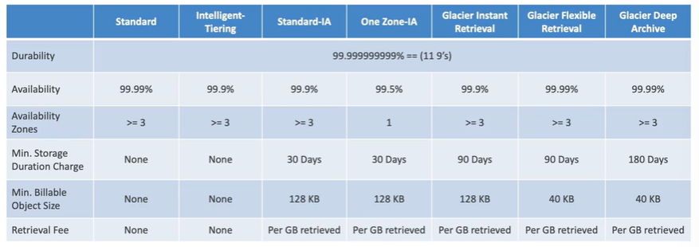

# Section 5: Compute quiz #quiz #compute
collapsed:: true
	- **ASG Lifecycle Hooks**: feature that allow to perform action before the instance is terminated
	- ACM certificate for the custom domain name **MUST** be requested or imported in the us-east-1 region
	- Which Route53 record will minimize the network time between a server and a client?
		- **Latency, and it has failover capability**
	- Give permissions to ECS services using EC2 instances
		- Create an EC2 instance role. Create one IAM ECS task role for each service and reference it in the task definition
- # Elastic Block Storage #storage #ebs
  collapsed:: true
	- Network drive you attach to **ONE INSTANCE ONLY**
	- Linked to a specific AZ (snapshot -> restore)
	- Volumes can be resized
		- Just up the size, **YOU CANNOT REDUCE SIZE**
	- **EBS volume types**
		- EBS volumes are defined in **size, throughput and IOPS**
		- Only gp2/gp3 and io1/io2 can be used as boot volumes
		- There are 6 types:
			- **gp2/gp3 (SSD)** -> General Purpose SSD volume
			- **io1/io2 Block Express** -> Highest-performance SSD volume for mission-critical low-latency or high-throughput workloads.
			- **st1 (HDD)** -> Low cost HDD designed for frequently accessed, throughput-intensive workloads
			- **sc1 (HDD)** -> Lowest cost HDD, designed for infrequent accessed workloads
	- **EBS Snapshots**
		- **Incremental, only backup changed blocks**
		- EBS backups use IO and you shouldn't run them while your app is handling a lot of traffic
		- Snapshot will be stored in S3
		- Not necessary to detach volume to do snapshot, but recommended
		- Can copy snapshots across region for disaster recovery
		- Can make AMI from snapshots
		- To restore the EBS volumes from snapshots
			- Use *Fast Snapshot Restore (FSR)* feature
			- fio/dd command to read the entire volume
	- **Amazon Data Lifecycle Manager (DML)**
		- Automate the creation, retention and deletion of EBS snapshots and EBS-backed AMIs
			- Schedule backups, cross-account snapshot copies, delete outdated backups
			- Use resource tags to identify the resources
			- Cannot be used to manage resources created outside DML
			- **vs. AWS Backup** -> DML is focused on EBS volumes. AWS Backup is used across the AWS services and centralise the management in there.
	- **Encryption**
		- Account level setting
			- **New Amazon EBS volumes are not encrypted by default**
			- This setting **MUST** be enabled per-region
	- **EBS Multi-Attach**
		- **io1/io2 family exclusive feature**
		- Attach the same EBS volume to multiple EC2 instances in the same AZ
		- Each instance has full R/W permissions to the volume
		- **MUST** use a file system that's cluster-aware
		- **Use case**:
			- Achieve **higher application availability** in clustered Linux applications
			- Applications **MUST** manage concurrent write operations
	- **Local EC2 Instance Store**
		- Physical disk attached to the phyisical server where your EC2 is
			- Very High IOPS
			- Disks ups to 7.5TiB, stripped to reach 60TiB
			- Cannot be increased in size
			- Risk of data loss if hardware fails
			- **vs. EBS**
				- Instance store is ephemeral. EBS is persistent
				- Better I/O performance, good for buffer/caching, data survives reboots
				- On stop or termination, the instance store is lost. Also, you cannot resized it and backups **MUST** be operated by the user
- # Amazon Elastic File Storage #storage #efs #nfs
  collapsed:: true
	- Managed NFS thaht can be mounted on many EC2
		- EFS works with EC2 instances in multi-AZ and on-prem (DX & VPN)
	- Highly availability, scalable, expensive (x3 gp2, but you pay per GB used)
	- **Use cases** -> content management, web serving, data sharing, WordPrress
	- Compatible with Linux based AMI, POSIX-compliant (standard file API)
		- Uses NFSv4.1 protocol
	- Uses security group to control access to EFS
	- Encryption at rest using KMS
	- File system scales automatically, pay-per-use, no capacity planning!
	- **Performance**
		- **EFS Scale**
			- 1000s of concurrent NFS clients, 10GB+/s throughput
			- Grow to Petabyte-scale NFS automatically
		- **Performance Mode**
			- **General Purpose (default)** -> latency-sensitive use cases
			- **Max I/O** -> higher latency, throughput, highly parallel
		- **Throughput Mode**
			- **Bursting** -> Depending on the size, you get a throughput that can be increased automatically if necessary.
			- **Provisioned** -> set your throughput regardless of storage size
			- **Elastic** -> automatically scales throughput up or down based on your workloads
				- Used for unpredictable workloads
	- **Storage Classes**
		- Implement lifecycle policies to move files between storage tiers
			- Over a 90% in cost savings
		- **Storage Tiers**
			- **Standard**
				- Frequently accessed files
			- **Infrequent Access (EFS-IA)**
				- Cost to retrieve files, lower price to store
			- **Archive**
				- Rarely accessed data (few times each year, 50% cheaper)
		- **Availability and durability**
			- **Standard** -> Multi-AZ, great for production environments
			- **One Zone** -> One AZ, great for dev, backup enabled by default. Compatible with IA (EFS One Zone-IA)
	- **On-prem** -> use DX or S2S VPN to connect. Use EFS ENIs IPv4 and not the DNS name to mount the file system
	- **VPC Peering** -> use it to mount the file system in other VPCs. You can use the file system DNS name
	- **Access Points**
		- Easily manage applications access to NFS environments
		- Enforce a POSIX user and group to use when accessing the file system
		- Restrict access to a directory within the file system and optionally specify a different root directory
		- Can restrict access from NFS clients using IAM policies
	- **File system Policies**
		- **Resource-based policy** to control access to EFS file systems
			- By default, it grants full access to all clients
	- **Cross-Region Replication**
		- Replicate objects in an EFS file system to another AWS Region
			- Setup for new or existing EFS file systems
		- Provides RPO and RTO of minutes
		- Doesn't affect the provisioned throughput of the EFS file system
		- **Use cases**: meet your compliance and business continuity goals
- # Amazon Simple Storage Service (S3) #storage #s3
  collapsed:: true
	- Object storage, serverless, unlimited storage, pay-as-you-go
		- Good to store static content (image, video files)
		- Access objects by key, no indexing facility
		- **Anti-patterns**
			- Lots of small files
			- POSIX file system, file locks
				- **Not a file system, cannot be mounted natively on EC2**
			- Search features, queries, rapidly changing data (dynamic content)
	- **Storage clasess**
	  collapsed:: true
		- You can transition objects between tiers (or delete) using S3 Lifecycle Policies
		- 
	- **Replication (Versioning enabled)**
	  collapsed:: true
		- **Cross Region Replication (CRR)** and **Same Region Replication (SRR)**
		- Combine with lifecycle rules
		- Helpful to reduce latency, disaster recovery and security
		- **S3 Replication time Control (S3 RTC)**
			- Replicates most object that you upload to S3 in seconds, and 99.99% of those objects within 15 minutes
			- Helpful for compliance, disaster recorvery, etc.
	- **Event Notifications**
	  collapsed:: true
		- Event -> S3 API call
		- Object name filtering is possible
		- **Use case** -> generate thumbnails of images uploaded to S3
		- Unlimited creation
		- S3 events notification typically deliver events in seconds but can sometimes take a minute or longer
		- You can **leverage in Amazon EventBridge**
			- Advanced filtering options with JSON rules
			- Multiple destinations
			- EventBridge capabilities are included
	- **Baseline performance**
	  collapsed:: true
		- Automatically scales to high request rates, latency (100-200ms)
			- 3500 write requests
			- 5500 read requests
		- Non limits to the number of prefixes in a bucket
		- **Multi-part upload**
			- Recommended for files >100MB, **MANDATORY** for files >5GB
			- Can help to parallel uploads
			- **Remove incomplete parts**
				- Use lifecycle policy to abort and delete incomplete multi-part uploads after X days.
		- **S3 Transfer Acceleration**
			- Increase transfer speed by transferring file to an AWS edge location which will forward the data to the S3 bucket in the target region
				- Compatible with multi-part upload
		- **S3 Byte-Range Fetches**
			- Parallelize GETs by requesting specific byte ranges
			- Better resilience in case of failures
			- **Use cases** -> Speed up downloads, **retrieve only partial data (first XX bytes)**
		- **S3 Analytics - Storage Class Analysis**
			- Help you decide when to transition objects to the right storage class
			- Recommendations for Standard and Standard IA
				- Does **NOT** work for One-Zone IA or Glacier
			- Report is updated daily
				- It needs 24-48 hours to start seeing data analysis
				- Visualize data in Amazon QuickSight
		- **Storage Lens**
			-
		- ## S3 Solution Architecture #storage #s3 #sa
			-